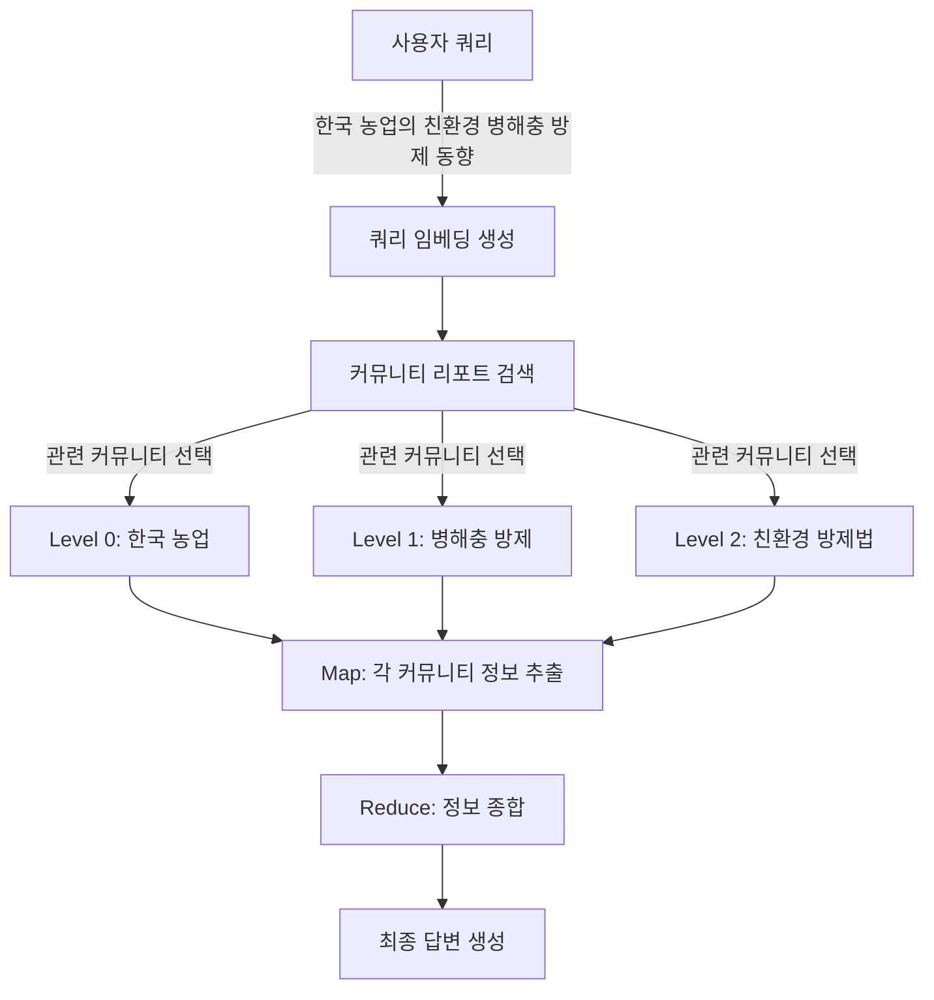

> **Public snapshot note**
> 이 문서/노트북은 원래 연구 실행 흐름을 보존한 archival artifact다.
> 공개 스냅샷에서는 raw PDF, processed corpus, `kg_gen/graphrag_workspace/input`, `kg_gen/graphrag_workspace/output`,
> `kg_gen/snu_kg_output/graphrag_workspace/output*` 등 bulk/source-derived 자산을 의도적으로 제외했다.
> 따라서 아래의 일부 경로 설명은 **원래 실험 환경 기준**이며, 현재 public snapshot과 1:1로 대응하지 않을 수 있다.

# GraphRAG 파이프라인 상세 문서

## 📁 1. 데이터 저장 구조

### 1.1 디렉토리 구조 (기준: `/kg_gen`)

```
kg_gen/
├── graphrag/                    # GraphRAG 소스코드
└── graphrag_workspace/         # 작업 공간
    ├── input/                  # 입력 텍스트 파일들
    │   ├── agriculture_doc_001.txt
    │   └── agriculture_doc_002.txt
    ├── output/                 # 생성된 지식그래프
    │   ├── entities.parquet    # 엔티티 정보
    │   ├── relationships.parquet # 관계 정보
    │   ├── communities.parquet # 커뮤니티 구조
    │   ├── community_reports.parquet # 커뮤니티 요약
    │   ├── text_units.parquet  # 텍스트 청크
    │   ├── documents.parquet   # 원본 문서 메타데이터
    │   └── lancedb/           # 벡터 임베딩 저장소
    │       ├── default-text_unit-text.lance/
    │       ├── default-entity-description.lance/
    │       └── default-community-full_content.lance/
    └── prompts/               # 도메인 특화 프롬프트
```

### 1.2 벡터 임베딩 저장 경로

**LanceDB 벡터 데이터베이스** (`graphrag_workspace/output/lancedb/`):

| 디렉토리 | 내용 | 차원 |
|---------|------|------|
| `default-text_unit-text.lance/` | 텍스트 청크 임베딩 | 1536 |
| `default-entity-description.lance/` | 엔티티 설명 임베딩 | 1536 |
| `default-community-full_content.lance/` | 커뮤니티 리포트 임베딩 | 1536 |

## 📊 2. 저장된 데이터 구조와 의미

### 2.1 엔티티 (`entities.parquet`)

**구조**:
```python
{
    "id": "키토산_001",
    "title": "키토산",
    "type": "농업 자재",
    "description": "게나 새우 껍질에서 추출한 천연 고분자 물질로, 병해충 방제와 작물 생육 촉진에 사용",
    "frequency": 45,  # 텍스트에서 언급된 횟수
    "degree": 12,     # 다른 엔티티와의 연결 수
    "text_unit_ids": ["chunk_001", "chunk_015", "chunk_023"]
}
```

**예시**:
- 엔티티: "토마토 잎곰팡이병"
- 타입: "병해"
- 설명: "Fulvia fulva에 의해 발생하는 토마토의 주요 병해"

### 2.2 관계 (`relationships.parquet`)

**구조**:
```python
{
    "id": "rel_001",
    "source": "키토산",
    "target": "토마토 잎곰팡이병",
    "description": "52-83%의 방제 효과를 보임",
    "weight": 0.85,  # 관계의 강도   GraphRAG의 원래 weight 계산:
        # - 초기값: LLM이 추정한 관계 강도 (보통 1-10)
        # - 중복 시: 동일 관계가 여러 번 나타나면 weight를 합산
        # - 기본값: LLM이 강도를 제공하지 않으면 1.0
    "text_unit_ids": ["chunk_001", "chunk_023"]
}
```

**예시 관계들**:
- 키토산 → [방제 효과] → 토마토 잎곰팡이병
- 토마토 → [적정 재배 온도] → 25-28℃
- 친환경 농업 → [활용 자재] → 키토산

### 2.3 커뮤니티 (`communities.parquet`)

**구조**:
```python
{
    "community": 1,
    "level": 0,  # 계층 레벨 (0=최상위)
    "title": "토마토 병해충 관리",
    "entity_ids": ["키토산", "토마토 잎곰팡이병", "방제법"],
    "size": 15,  # 커뮤니티 내 엔티티 수
    "parent": None,
    "children": [3, 4]  # 하위 커뮤니티 ID
}
```

**계층 예시**:
```
Level 0: 한국 농업 전반
├── Level 1: 작물 재배 기술
│   └── Level 2: 토마토 재배
└── Level 1: 병해충 방제
    └── Level 2: 친환경 방제법
```

### 2.4 텍스트 유닛 (`text_units.parquet`)

**구조**:
```python
{
    "id": "chunk_001",
    "text": "키토산은 키틴의 탈아세틸화로 만든 고분자 다당체로...",
    "n_tokens": 300,
    "document_ids": ["doc_001"],
    "entity_ids": ["키토산_001", "병해충방제_002"],
    "relationship_ids": ["rel_001", "rel_003"]
}
```

### 2.5 벡터 임베딩 (LanceDB)

**저장 형식**:
```python
# text_unit 임베딩 예시
{
    "id": "chunk_001",
    "text": "키토산은 키틴의 탈아세틸화로...",
    "embedding": [0.0234, -0.1123, 0.0891, ...],  # 1536차원 벡터
    "metadata": {
        "document_id": "doc_001",
        "token_count": 300
    }
}
```

## 🔍 3. Local Search 파이프라인

### 3.1 전체 흐름도

```mermaid
graph TD
    A[사용자 쿼리] -->|"키토산의 병해충 방제 효과"| B[쿼리 임베딩 생성]
    B -->|text-embedding-ada-002| C[1536차원 벡터]
    C --> D[LanceDB 벡터 검색]
    
    D --> E[텍스트 유닛 검색]
    E -->|상위 k=10개| F[유사 텍스트 청크]
    
    F --> G[엔티티 추출]
    G -->|"키토산", "잎곰팡이병"| H[엔티티 확장]
    
    H --> I[그래프 탐색]
    I -->|1-hop neighbors| J[관련 엔티티/관계]
    
    J --> K[컨텍스트 구성]
    K --> L[프롬프트 생성]
    L --> M[GPT-4o 호출]
    M --> N[최종 답변]
```

### 3.2 단계별 상세 과정

#### **Step 1: 쿼리 임베딩**
```python
query = "키토산의 병해충 방제 효과는?"
query_embedding = text_embedding_model.encode(query)
# → [0.0234, -0.1123, 0.0891, ...] (1536차원)
```

#### **Step 2: 벡터 검색**
```python
# graphrag_workspace/output/lancedb/default-text_unit-text.lance에서 검색
similar_chunks = vector_db.search(
    query_embedding, 
    k=10,  # 상위 10개
    metric="cosine"
)

# 결과 예시:
[
    {"id": "chunk_001", "score": 0.92, "text": "키토산은 토마토 잎곰팡이병에 52-83% 방제 효과..."},
    {"id": "chunk_023", "score": 0.88, "text": "친환경 병해충 방제를 위한 키토산 활용법..."},
    ...
]
```

#### **Step 3: 엔티티 매핑**
```python
# 찾은 텍스트 청크에서 엔티티 추출
entities_in_chunks = ["키토산", "토마토 잎곰팡이병", "방제율", "친환경 농법"]

# entities.parquet에서 상세 정보 조회
entity_details = {
    "키토산": {
        "type": "농업 자재",
        "description": "천연 고분자 방제 물질",
        "degree": 12  # 연결된 엔티티 수
    }
}
```

#### **Step 4: 그래프 확장**
```python
# relationships.parquet에서 1-hop 관계 탐색
expanded_context = {
    "entities": ["키토산", "토마토 잎곰팡이병", "Fulvia fulva", "병방제율"],
    "relationships": [
        "키토산 → [52-83% 방제 효과] → 토마토 잎곰팡이병",
        "키토산 → [1,200mg/L 적정 농도] → 병해충 방제",
        "토마토 잎곰팡이병 → [원인균] → Fulvia fulva"
    ]
}
```

#### **Step 5: 컨텍스트 구성**
```python
context = f"""
## 관련 엔티티:
- 키토산: 천연 고분자 방제 물질, 게/새우 껍질 추출
- 토마토 잎곰팡이병: Fulvia fulva에 의한 병해, 습도 높을 때 발생
- 방제율: 52-83% (실험 결과)

## 관계:
- 키토산은 토마토 잎곰팡이병에 52-83%의 방제 효과를 보임
- 최적 농도는 1,200mg/L (SH-1-100 제형)
- 예방 효과는 살포 후 21일까지 지속

## 상세 정보:
{retrieved_text_chunks}
"""
```

#### **Step 6: LLM 호출**
```python
messages = [
    {
        "role": "system", 
        "content": LOCAL_SEARCH_SYSTEM_PROMPT  # prompts/local_search_system_prompt.txt
    },
    {
        "role": "user",
        "content": f"{context}\n\n질문: {query}"
    }
]

response = openai.ChatCompletion.create(
    model="gpt-4o",
    messages=messages,
    temperature=0
)
```

#### **최종 답변 예시**:
```
키토산의 병해충 방제 효과는 다음과 같습니다:

1. **토마토 잎곰팡이병 방제**: 52-83%의 높은 방제율을 보입니다.
2. **최적 사용 농도**: 1,200mg/L (100배 희석)
3. **지속 기간**: 살포 후 21일까지 효과 지속
4. **작용 메커니즘**: 
   - 병원균의 세포벽 침입 약화
   - 식물 세포의 방어능력 강화
   - 키티나아제 생산 유도
5. **추가 효과**: 작물 생육 촉진 효과도 있음
```

## 🌐 4. Global Search 파이프라인

### 4.1 전체 흐름도



### 4.2 단계별 상세 과정

#### **Step 1: 커뮤니티 검색**
```python
query = "한국 농업의 친환경 병해충 방제 동향은?"

# graphrag_workspace/output/lancedb/default-community-full_content.lance에서 검색
relevant_communities = vector_search(
    query_embedding,
    k=5,  # 상위 5개 커뮤니티
    source="community_reports"
)

# 결과:
[
    {"id": 1, "level": 0, "title": "한국 농업 전반", "rank": 85},
    {"id": 5, "level": 1, "title": "병해충 방제 기술", "rank": 90},
    {"id": 12, "level": 2, "title": "친환경 방제법", "rank": 95}
]
```

#### **Step 2: Map 단계**
```python
# 각 커뮤니티 리포트에서 정보 추출
for community in relevant_communities:
    map_prompt = f"""
    다음 커뮤니티 리포트에서 '{query}'와 관련된 핵심 정보를 추출하세요:
    
    커뮤니티: {community.title}
    내용: {community.full_content}
    
    핵심 포인트를 5개 이내로 요약하세요.
    """
    
    map_response = llm.generate(map_prompt)
    map_results.append(map_response)
```

**Map 결과 예시**:
```
커뮤니티 1 (한국 농업 전반):
- 친환경 농업 비중 증가 추세
- 화학 농약 사용 감소 정책

커뮤니티 5 (병해충 방제 기술):
- 키토산 등 천연 물질 활용 증가
- 생물학적 방제 기술 발전

커뮤니티 12 (친환경 방제법):
- 키토산 방제 효과 52-83%
- 미생물 제제 활용 확대
```

#### **Step 3: Reduce 단계**
```python
reduce_prompt = f"""
다음은 여러 관점에서 분석한 '{query}'에 대한 정보입니다:

{all_map_results}

이를 종합하여 포괄적이고 일관된 답변을 작성하세요.
"""

final_response = llm.generate(reduce_prompt)
```

#### **최종 답변 예시**:
```
한국 농업의 친환경 병해충 방제 동향은 다음과 같습니다:

## 전반적 동향
1. **정책적 변화**: 화학 농약 사용 감소 및 친환경 농업 확대 정책 시행
2. **시장 성장**: 친환경 농산물 시장 연평균 15% 성장

## 주요 기술 발전
1. **천연 물질 활용**:
   - 키토산: 토마토 병해충에 52-83% 방제율
   - 목초액, 현미식초 등 복합 제제 개발

2. **생물학적 방제**:
   - 유용 미생물 활용 증가
   - 천적 곤충 이용 확대

3. **통합 관리 시스템**:
   - IPM(통합병해충관리) 도입
   - 스마트팜 기술과 연계

## 향후 전망
- 2030년까지 친환경 농업 비중 30% 목표
- AI 기반 병해충 예측 시스템 도입
- 농가 교육 및 기술 지원 확대
```

## 📌 5. 핵심 차이점 요약

| 구분 | Local Search | Global Search |
|------|-------------|---------------|
| **목적** | 특정 정보 검색 | 종합적 인사이트 |
| **사용 임베딩** | 텍스트 유닛, 엔티티 | 커뮤니티 리포트 |
| **검색 범위** | 엔티티와 1-hop 이웃 | 계층적 커뮤니티 전체 |
| **처리 방식** | 직접 컨텍스트 구성 | Map-Reduce 패턴 |
| **적합한 질문** | "키토산의 효과는?" | "농업 동향은?" |
| **응답 특성** | 구체적, 상세함 | 포괄적, 종합적 |

## 🔧 6. 설정 파일 위치

- **임베딩 설정**: `graphrag_workspace/settings.yaml`의 `embed_text` 섹션
- **검색 설정**: `local_search`, `global_search` 섹션
- **프롬프트**: `graphrag_workspace/prompts/` 디렉토리

이 파이프라인을 통해 GraphRAG는 로컬에 저장된 지식그래프와 벡터 임베딩을 활용하여, OpenAI의 LLM에 풍부한 컨텍스트를 제공하고 정확한 답변을 생성합니다.

---------------------------------------------------------------------------------------------------------------------------

# GraphRAG 동의어/다언어 처리 해결 방안

## 문제점 정리

1. **현재 상황**
   - "토마토"와 "tomato"는 서로 다른 엔티티로 처리됨
   - "CMV"와 "오이모자이크바이러스"도 서로 다른 엔티티로 처리됨
   - Local Search에서 k=10 검색 시 각각이 따로 검색되어 효율성 저하

2. **코드 분석 결과**
   - 엔티티 이름은 대문자로 변환되나, 한글은 변환되지 않음
   - 동의어나 다언어 처리를 위한 별도 로직 없음
   - 엔티티는 `title`과 `type`이 동일한 경우에만 병합됨

## 해결 방안

### 방안 1: 프롬프트 수정 (즉시 적용 가능)

`/kg_gen/graphrag_workspace/prompts/extract_graph.txt` 수정:

```text
-Steps-
1. Identify all entities. For each identified entity, extract the following information:
- entity_name: Name of the entity. 
  * For agricultural terms with known translations, use the Korean name (e.g., "토마토" not "tomato", "오이모자이크바이러스" not "CMV")
  * For disease abbreviations, include both forms: "오이모자이크바이러스(CMV)"
  * Maintain consistency across the entire document
- entity_type: One of the following types: [...]
- entity_description: Include alternative names and abbreviations in the description
```

### 방안 2: 후처리 스크립트 작성 (권장)

```python
# synonym_mapper.py
import pandas as pd

# 동의어 매핑 테이블
SYNONYM_MAP = {
    # 작물
    "TOMATO": "토마토",
    "tomato": "토마토",
    "CUCUMBER": "오이",
    "cucumber": "오이",
    
    # 병해충
    "CMV": "오이모자이크바이러스(CMV)",
    "오이모자이크바이러스": "오이모자이크바이러스(CMV)",
    "TMV": "담배모자이크바이러스(TMV)",
    "담배모자이크바이러스": "담배모자이크바이러스(TMV)",
    
    # 농업 자재
    "chitosan": "키토산",
    "CHITOSAN": "키토산",
}

def normalize_entities(entities_df):
    """엔티티 이름을 정규화"""
    entities_df = entities_df.copy()
    
    # 동의어 매핑 적용
    entities_df['title'] = entities_df['title'].map(
        lambda x: SYNONYM_MAP.get(x, x)
    )
    
    # 동일한 title과 type을 가진 엔티티 병합
    merged = entities_df.groupby(['title', 'type']).agg({
        'description': lambda x: ' '.join(x.unique()),
        'text_unit_ids': lambda x: list(set(sum(x, []))),
        'frequency': 'sum',
        'degree': 'max',
        'id': 'first'  # 첫 번째 ID 유지
    }).reset_index()
    
    return merged

# 사용 예시
entities = pd.read_parquet('graphrag_workspace/output/entities.parquet')
entities_normalized = normalize_entities(entities)
entities_normalized.to_parquet('graphrag_workspace/output/entities_normalized.parquet')
```

### 방안 3: 검색 시 쿼리 확장

```python
def expand_query(query):
    """검색 쿼리를 동의어로 확장"""
    expansions = []
    
    # 쿼리에서 키워드 추출 및 확장
    for term, synonyms in SYNONYM_MAP.items():
        if term.lower() in query.lower():
            for synonym in synonyms:
                expanded = query.replace(term, synonym)
                expansions.append(expanded)
    
    # 원본 쿼리 포함
    expansions.append(query)
    return list(set(expansions))

# Local Search 수정 예시
queries = expand_query("토마토의 CMV 방제 방법")
# ["토마토의 CMV 방제 방법", "토마토의 오이모자이크바이러스(CMV) 방제 방법"]

# 각 쿼리로 검색 후 결과 병합
all_results = []
for q in queries:
    results = local_search(q, k=5)  # k를 나눠서 검색
    all_results.extend(results)

# 중복 제거 및 상위 k개 선택
final_results = deduplicate_and_rank(all_results, k=10)
```

### 방안 4: 임베딩 기반 유사도 검사 (장기적 해결책)

```python
from sentence_transformers import SentenceTransformer
import numpy as np

model = SentenceTransformer('sentence-transformers/xlm-r-100langs-bert-base-nli-stsb-mean-tokens')

def find_similar_entities(entities_df, threshold=0.85):
    """임베딩 기반으로 유사한 엔티티 찾기"""
    titles = entities_df['title'].tolist()
    embeddings = model.encode(titles)
    
    similar_pairs = []
    for i in range(len(titles)):
        for j in range(i+1, len(titles)):
            similarity = np.dot(embeddings[i], embeddings[j]) / (
                np.linalg.norm(embeddings[i]) * np.linalg.norm(embeddings[j])
            )
            if similarity > threshold:
                similar_pairs.append((titles[i], titles[j], similarity))
    
    return similar_pairs

# 유사 엔티티 자동 병합
similar = find_similar_entities(entities)
print("유사 엔티티 발견:")
for e1, e2, score in similar:
    print(f"{e1} <-> {e2}: {score:.2f}")
```

## 권장 적용 순서

1. **즉시**: 프롬프트 수정 (방안 1) - 새로운 인덱싱에 적용
2. **단기**: 후처리 스크립트 (방안 2) - 기존 데이터 정규화
3. **중기**: 검색 쿼리 확장 (방안 3) - 검색 정확도 향상
4. **장기**: 임베딩 기반 방법 (방안 4) - 자동화된 동의어 발견

## 예상 효과

- 검색 정확도 향상: 동의어가 통합되어 관련 정보 누락 방지
- 그래프 품질 개선: 중복 엔티티 제거로 더 명확한 관계 파악
- 다언어 지원: 한국어/영어 혼용 문서에서도 일관된 결과