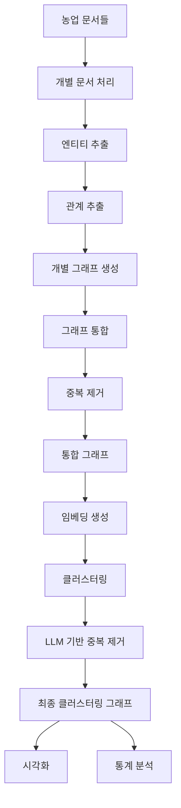

# kg-gen 파이프라인 상세 문서

## 📁 1. 데이터 저장 구조

### 1.1 디렉토리 구조 (기준: `/kg_gen`)

```
kg_gen/
├── kg-gen/                     # kg-gen 소스코드
├── kg-gen_agricultural.ipynb   # 농업 데이터 처리 노트북
└── kg_output/                  # 생성된 지식그래프 저장소
    ├── graphs/                 # 그래프 JSON 파일들
    │   ├── individual/         # 개별 문서 그래프
    │   │   ├── graph.json      # kg.generate()가 자동 생성
    │   │   ├── doc_001_graph.json
    │   │   ├── doc_002_graph.json
    │   │   └── ...
    │   ├── aggregated/         # 통합된 그래프
    │   │   └── aggregated_graph.json
    │   └── clustered/          # 클러스터링된 최종 그래프
    │       └── final_clustered_graph.json
    ├── visualizations/         # HTML 시각화 파일들
    │   ├── sample_individual_graph.html
    │   ├── aggregated_graph.html
    │   └── final_clustered_graph.html
    └── statistics/             # 통계 및 분석 결과
        └── kg_statistics.json
```

### 1.2 파일 저장 방식

**자동 생성 파일**:
- `output_folder` 파라미터 사용 시 `graph.json` 자동 생성
- 각 `generate()` 호출마다 덮어씌워짐

**수동 저장 파일**:
- 문서별 추적을 위해 `doc_XXX_graph.json` 형식으로 추가 저장
- 메타데이터 포함 (문서 제목, ID 등)

## 📊 2. 저장된 데이터 구조와 의미

### 2.1 Graph 객체 구조

```python
from kg_gen.models import Graph

# Graph 객체의 기본 구조
Graph(
    entities=set(),      # 추출된 엔티티 집합
    edges=set(),        # 관계 타입 집합 (predicate들)
    relations=set(),    # (subject, predicate, object) 튜플 집합
    entity_clusters={}, # 엔티티 클러스터 정보 (클러스터링 후)
    edge_clusters={}    # 관계 클러스터 정보 (클러스터링 후)
)
```

### 2.2 개별 문서 그래프 (`individual/doc_001_graph.json`)

**구조**:
```json
{
    "doc_id": 1,
    "doc_title": "토마토 잎곰팡이병에 대한 키토산 제제의 방제 효과",
    "entities": ["키토산", "토마토", "잎곰팡이병", "Fulvia fulva", "병방제"],
    "relations": [
        ["키토산", "방제효과를 보인다", "토마토 잎곰팡이병"],
        ["토마토 잎곰팡이병", "원인균은", "Fulvia fulva"],
        ["키토산", "농도는", "1200mg/L"]
    ],
    "edges": ["방제효과를 보인다", "원인균은", "농도는"]
}
```

**예시 엔티티들**:
- 작물: "토마토", "오이", "배추"
- 병해충: "잎곰팡이병", "흰가루병", "진딧물"
- 농업자재: "키토산", "목초액", "미생물제제"
- 기술/방법: "친환경 방제", "통합병해충관리(IPM)"

### 2.3 통합 그래프 (`aggregated/aggregated_graph.json`)

**구조**:
```json
{
    "metadata": {
        "created_at": "2024-11-20T10:30:00",
        "source_graphs": 10,
        "total_entities_before": 450,
        "total_relations_before": 680
    },
    "entities": ["키토산", "토마토", ...],  // 중복 제거된 엔티티
    "relations": [...],                      // 모든 관계 통합
    "edges": [...]                          // 고유 관계 타입들
}
```

**통합 효과**:
- 개별 문서의 중복 엔티티 자동 제거
- 동일한 관계도 하나로 통합
- 전체 지식그래프 구조 형성

### 2.4 클러스터링 그래프 (`clustered/final_clustered_graph.json`)

**구조**:
```json
{
    "metadata": {
        "created_at": "2024-11-20T11:00:00",
        "clustering_time": 125.3,
        "model": "openai/gpt-4o-mini",
        "retrieval_model": "sentence-transformers/all-MiniLM-L6-v2"
    },
    "entities": [...],
    "relations": [...],
    "edges": [...],
    "entity_clusters": {
        "토마토": ["토마토", "Tomato", "방울토마토"],
        "병해충방제": ["방제", "병해충방제", "방제법", "방제효과"],
        "키토산": ["키토산", "chitosan", "키틴질"]
    },
    "edge_clusters": {
        "효과를 보인다": ["효과를 보인다", "효과가 있다", "효능을 나타낸다"],
        "원인이 된다": ["원인균은", "원인이 된다", "발생시킨다"]
    }
}
```

**클러스터링 특징**:
- 의미적으로 유사한 엔티티 그룹화
- 동의어, 약어, 변형 통합
- LLM 기반 의미 분석으로 정확한 클러스터링

## 🔍 3. kg-gen 처리 파이프라인

### 3.1 전체 흐름도



### 3.2 단계별 상세 과정

#### **Step 1: 개별 문서 처리**
```python
# kg-gen의 generate() 함수 호출
for doc in documents:
    graph = kg.generate(
        input_data=doc['text'],
        chunk_size=1000,  # 자동 청킹
        context="한국 농업 문서. 모든 엔티티와 관계는 반드시 한국어로 추출하세요.",
        output_folder="kg_output/graphs/individual/"
    )
```

**내부 프로세스**:
1. **청킹**: 1000자 단위로 텍스트 분할
2. **병렬 처리**: ThreadPoolExecutor로 청크 동시 처리
3. **DSPy 프롬프트 실행**:
   - `TextEntities` 또는 `ConversationEntities` 클래스
   - 한국어 추출 지시사항 포함

#### **Step 2: 엔티티 추출 (`_1_get_entities.py`)**
```python
class TextEntities(dspy.Signature):
    """Extract key entities from the source text...
    모든 엔티티는 반드시 한국어를 베이스로 추출하세요."""
    
    source_text: str = dspy.InputField()
    entities: list[str] = dspy.OutputField(desc="THOROUGH list of key entities in Korean")
```

**추출 예시**:
```
입력: "키토산은 토마토 잎곰팡이병에 52-83%의 방제 효과를 보였다."
출력: ["키토산", "토마토", "잎곰팡이병", "방제 효과", "52-83%"]
```

#### **Step 3: 관계 추출 (`_2_get_relations.py`)**
```python
class ExtractTextRelations(dspy.Signature):
    """Extract subject-predicate-object triples...
    모든 관계(predicate)는 반드시 한국어를 베이스로 추출하세요."""
    
    source_text: str = dspy.InputField()
    entities: list[str] = dspy.InputField()
    relations: list[Relation] = dspy.OutputField(
        desc="List of subject-predicate-object tuples. All predicates must be in Korean."
    )
```

**추출 예시**:
```
엔티티: ["키토산", "토마토 잎곰팡이병", "52-83%"]
관계: [
    ("키토산", "방제 효과를 보인다", "토마토 잎곰팡이병"),
    ("키토산", "방제율은", "52-83%")
]
```

#### **Step 4: 그래프 통합 (`aggregate()`)**
```python
# kg_gen.py의 aggregate 메서드
def aggregate(self, graphs: list[Graph]) -> Graph:
    all_entities = set()
    all_relations = set()
    all_edges = set()
    
    for graph in graphs:
        all_entities.update(graph.entities)
        all_relations.update(graph.relations)
        all_edges.update(graph.edges)
    
    return Graph(entities=all_entities, relations=all_relations, edges=all_edges)
```

**통합 효과**:
- 10개 문서, 각 50개 엔티티 → 통합 후 200개 (중복 제거)
- 관계도 자동으로 중복 제거

#### **Step 5: 클러스터링 (`_3_deduplicate.py`)**

**5.1 임베딩 생성**:
```python
# sentence-transformers 사용
retrieval_model = SentenceTransformer("all-MiniLM-L6-v2")
node_embeddings = retrieval_model.encode(entities, show_progress_bar=True)
```

**5.2 K-means 클러스터링**:
```python
kmeans = KMeans(
    n_clusters=num_clusters,
    max_iter=20
)
kmeans.fit(embeddings)
```

**5.3 LLM 기반 중복 제거**:
```python
class Deduplicate(dspy.Signature):
    """Find duplicate entities...
    한국어 단어의 경우 같은 의미를 갖는 다양한 형태를 고려하세요.
    alias는 반드시 한국어를 베이스로 작성하세요."""
    
    item: str = dspy.InputField()
    set: list[str] = dspy.InputField()
    duplicates: list[str] = dspy.OutputField()
    alias: str = dspy.OutputField()
```

**클러스터링 예시**:
```
입력: ["토마토", "Tomato", "방울토마토", "tomato"]
LLM 분석 결과:
- alias: "토마토"
- cluster: {"토마토", "Tomato", "tomato"}
- 별개 유지: "방울토마토" (다른 품종)
```

## 🌐 4. 검색 및 활용 파이프라인

### 4.1 지식그래프 기반 RAG 구조

```python
# kg_gen의 검색 기능
def retrieve(self, query: str, node_embeddings: dict, graph: nx.DiGraph, k: int = 8):
    # 1. 쿼리 임베딩 생성
    query_embedding = model.encode(query)
    
    # 2. 유사 노드 검색
    top_nodes = self.retrieve_relevant_nodes(query, node_embeddings, model, k)
    
    # 3. 그래프 컨텍스트 확장
    context = set()
    for node, _ in top_nodes:
        node_context = self.retrieve_context(node, graph, depth=2)
        context.update(node_context)
    
    return top_nodes, context, " ".join(context)
```

### 4.2 컨텍스트 확장 예시

**쿼리**: "키토산의 병해충 방제 효과는?"

**Step 1 - 관련 노드 검색**:
```python
top_nodes = [
    ("키토산", 0.92),
    ("병해충방제", 0.85),
    ("토마토 잎곰팡이병", 0.78)
]
```

**Step 2 - 2-hop 이웃 탐색**:
```python
context = [
    "키토산 방제 효과를 보인다 토마토 잎곰팡이병.",
    "키토산 방제율은 52-83%.",
    "토마토 잎곰팡이병 원인균은 Fulvia fulva.",
    "키토산 적정 농도는 1200mg/L.",
    "친환경 방제 활용한다 키토산."
]
```

**Step 3 - LLM 프롬프트 구성**:
```python
prompt = f"""
다음 지식그래프 정보를 바탕으로 질문에 답하세요.

컨텍스트:
{context}

질문: {query}
"""
```

## 📌 5. GraphRAG vs kg-gen 비교

| 구분 | GraphRAG | kg-gen |
|------|----------|---------|
| **그래프 구조** | Parquet 파일 (구조화) | JSON 파일 (유연함) |
| **저장 방식** | 엔티티/관계 분리 저장 | Graph 객체로 통합 저장 |
| **벡터 DB** | LanceDB (내장) | 별도 구현 필요 |
| **클러스터링** | Leiden 알고리즘 | K-means + LLM |
| **계층 구조** | 커뮤니티 계층 지원 | 플랫 구조 |
| **검색 방식** | Local/Global 구분 | 단일 검색 방식 |
| **프롬프트** | 파일 기반 관리 | 코드 내 정의 |
| **확장성** | 대규모 데이터 최적화 | 중소규모 적합 |

## 🔧 6. 주요 설정 및 사용법

### 6.1 기본 사용법
```python
from kg_gen import KGGen

# 초기화
kg = KGGen(
    model="openai/gpt-4o-mini",
    temperature=0.0,
    api_key="your-api-key"
)

# 그래프 생성
graph = kg.generate(
    input_data=text,
    chunk_size=1000,
    context="도메인 특화 지시사항",
    output_folder="output/"
)

# 시각화
KGGen.visualize(graph, "graph.html", open_in_browser=True)
```

### 6.2 클러스터링 사용
```python
# retrieval_model 포함 초기화
kg_with_retrieval = KGGen(
    model="openai/gpt-4o-mini",
    retrieval_model="sentence-transformers/all-MiniLM-L6-v2"
)

# 클러스터링 실행
clustered_graph = kg_with_retrieval.cluster(
    graph,
    context="클러스터링 시 한국어 의미를 우선 고려"
)
```

### 6.3 주요 파라미터

**generate() 파라미터**:
- `chunk_size`: 텍스트 분할 크기 (기본값 없음)
- `cluster`: 즉시 클러스터링 여부 (기본값 False)
- `output_folder`: 중간 결과 저장 경로

**성능 최적화 팁**:
- Rate limit 회피: 문서 간 1초 지연
- 청킹 크기: 1000-2000자 권장
- 모델 선택: gpt-4o-mini (높은 rate limit)

## 📊 7. 통계 및 분석

### 7.1 저장되는 통계 정보 (`statistics/kg_statistics.json`)

```json
{
    "analysis_time": "2024-11-20T12:00:00",
    "graph_type": "최종 클러스터링 그래프",
    "source_documents": 10,
    "basic_stats": {
        "total_entities": 245,
        "total_relations": 412,
        "unique_edge_types": 38,
        "entity_clusters": 187,
        "edge_clusters": 28
    },
    "top_entities": {
        "키토산": 45,
        "토마토": 38,
        "병해충방제": 32
    },
    "top_edges": {
        "효과를 보인다": 67,
        "적용한다": 45,
        "포함한다": 38
    }
}
```

### 7.2 시각화 특징

**Interactive HTML 그래프**:
- 노드 크기: 연결 수에 비례
- 엣지 색상: 관계 타입별 구분
- 줌/팬: 마우스로 조작 가능
- 노드 클릭: 상세 정보 표시

## 🚀 8. 확장 및 활용

### 8.1 다언어 지원 개선
```python
# 프롬프트 커스터마이징
context = """
한국 농업 문서. 
- 모든 엔티티는 한국어로 추출
- 영어 약어는 "한국어명(영어)" 형식으로
- 동의어는 대표 용어로 통일
"""
```

### 8.2 도메인 특화 확장
```python
# 농업 도메인 특화 설정
AGRICULTURAL_ENTITY_TYPES = [
    "작물", "병해충", "농업자재", "재배기술", 
    "토양", "기후조건", "수확방법"
]

# 관계 타입 제한
AGRICULTURAL_RELATIONS = [
    "재배한다", "방제한다", "적용한다", "발생한다",
    "영향을 준다", "포함한다", "필요로 한다"
]
```

### 8.3 GraphRAG와의 통합 활용
```python
# kg-gen으로 초기 그래프 생성 → GraphRAG로 계층 구조 추가
initial_graph = kg.generate(text)
enhanced_graph = convert_to_graphrag_format(initial_graph)
```

## 📝 9. 트러블슈팅

### 9.1 일반적인 문제 해결

**Rate Limit 에러**:
- chunk_size 줄이기 (1000 이하)
- 문서 간 지연 추가 (1-2초)
- gpt-4o-mini 모델 사용

**메모리 부족**:
- 배치 처리 대신 순차 처리
- 큰 문서는 사전 분할
- 중간 결과 저장 활성화

**한국어 추출 실패**:
- context 파라미터에 명시적 지시
- 소스 코드의 프롬프트 수정
- 후처리 스크립트 작성

### 9.2 성능 최적화

**처리 속도 향상**:
```python
# 병렬 처리 worker 수 조정
with ThreadPoolExecutor(max_workers=4) as executor:
    futures = [executor.submit(process, chunk) for chunk in chunks]
```

**정확도 향상**:
```python
# temperature 조정
kg = KGGen(temperature=0.0)  # 일관성 있는 추출

# 컨텍스트 구체화
context = "의학 논문. 약물명은 성분명(상품명) 형식으로."
```

이 문서는 kg-gen의 전체 파이프라인과 데이터 구조를 상세히 설명하여, 시스템의 작동 방식을 완전히 이해하고 활용할 수 있도록 작성되었습니다.