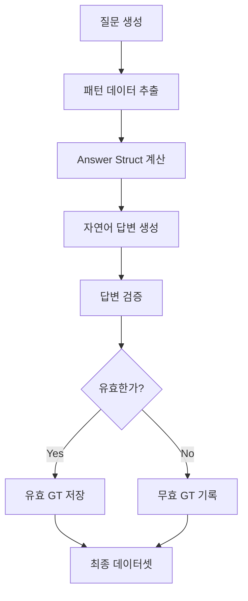

# Korean Agricultural GraphRAG QA Dataset Generation Process

## 개요

한국 농업 지식 그래프를 기반으로 한 고품질 Question-Answering 데이터셋 생성 과정에 대한 상세 문서입니다. 이 시스템은 5가지 QA 타입에 대해 질문 생성부터 Ground Truth 생성까지의 전체 파이프라인을 구현합니다.

---

## 1. QA 타입별 템플릿 및 생성 과정

### 1.1 Multi-hop Reasoning

**목적**: 여러 단계를 거쳐 추론해야 하는 복잡한 질문-답변 쌍 생성

#### 템플릿 구조
```json
{
  "question_id": "multi_hop_0_0",
  "pattern_id": "multi_hop_0", 
  "question": "토마토에서 LOW TEMPERATURE을(를) 거쳐 CROP로 이어지는 관계를 설명하세요.",
  "qa_type": "multi_hop",
  "difficulty": "medium"
}
```

#### 생성 과정
1. **패턴 파일 생성**
   ```python
   # 2hop_patterns.json, 3hop_patterns.json
   {
     "path": ["토마토", "LOW TEMPERATURE", "CROP"],
     "source": "토마토",
     "target": "CROP", 
     "relationships": ["related_to", "affects"],
     "hop_count": 2
   }
   ```

2. **질문 생성 알고리즘**
   - 그래프에서 2-3 hop 경로 탐색
   - 농업적으로 의미있는 경로 필터링
   - 자연어 질문 템플릿 적용

3. **Answer Struct 계산**
   ```python
   def compute_multihop_answer_struct(question, pattern_data):
       start_node = pattern_data['start_node']
       end_node = pattern_data['end_node']
       
       # 경로 탐색
       paths = find_all_paths(G, start_node, end_node, cutoff=3)
       
       return {
         'paths': paths,
         'all_entities': entities_in_paths,
         'all_relationships': relationships_in_paths,
         'hop_count': len(path) - 1,
         'evidence_text_unit_ids': relevant_text_units
       }
   ```

### 1.2 Community Synthesis

**목적**: 그래프 커뮤니티 내 정보를 종합하여 답변하는 질문 생성

#### 템플릿 구조
```json
{
  "question_id": "community_synthesis_0_0",
  "pattern_id": "community_synthesis_0",
  "question": "전주시 농업과 질병 관리 커뮤니티에서 중심성 상위 5개 엔티티를 제시하고, 주요 관계 유형 3개를 빈도순으로 나열하세요.",
  "community_id": 1,
  "level": 0,
  "qa_type": "community_synthesis", 
  "difficulty": "hard"
}
```

#### 생성 과정
1. **커뮤니티 탐지**
   - Leiden 알고리즘으로 계층적 커뮤니티 구조 생성
   - 각 레벨별 커뮤니티 식별

2. **커뮤니티 특성 분석**
   ```python
   def analyze_community(community_id, level):
       entities = get_community_entities(community_id, level)
       relationships = get_community_relationships(community_id, level)
       
       # 중심성 계산
       centrality = nx.degree_centrality(subgraph)
       
       return {
         'top_entities': sorted_by_centrality,
         'relationship_types': relationship_frequency,
         'size': len(entities)
       }
   ```

3. **Answer Struct 계산**
   ```python
   def compute_community_synthesis_answer_struct(question, pattern_data):
       community_id = pattern_data['community_id']
       level = pattern_data['level']
       
       community_data = get_community_data(community_id, level)
       
       return {
         'community_id': community_id,
         'top_entities': top_5_entities_by_centrality,
         'top_relationship_types': top_3_relationships_by_frequency,
         'community_summary': descriptive_summary,
         'evidence_text_unit_ids': supporting_text_units
       }
   ```

### 1.3 Cross-context Integration

**목적**: 여러 문서 맥락에서 동일 엔티티에 대한 정보 통합

#### 템플릿 구조  
```json
{
  "question_id": "cross_context_0_0",
  "pattern_id": "cross_context_0", 
  "question": "다중 문서에 걸친 LOW TEMPERATURE 정보를 통합하세요. 최소 2개의 서로 다른 문맥 근거를 명시하고 통합된 이해를 제시하세요.",
  "qa_type": "cross_context",
  "difficulty": "hard"
}
```

#### 생성 과정
1. **엔티티 중심 텍스트 유닛 수집**
   ```python
   def build_text_unit_edge_index(G):
       tu_to_triples = defaultdict(list)
       
       for u, v, attr in G.edges(data=True):
           tu_ids = collect_evidence_text_unit_ids(attr)
           for tu in tu_ids:
               tu_to_triples[str(tu)].append({
                   "s": u, "p": relation_type, "o": v,
                   "text_unit_ids": [str(tu)]
               })
       
       return tu_to_triples
   ```

2. **엔티티 추출 개선**
   ```python
   def extract_entities_improved(qa_type, question_text, question_data):
       if qa_type == 'cross_context':
           # 7단계 패턴 매칭
           patterns = [
               r'다중 문서에 걸친\s+(.+?)\s+정보를 통합',
               r'^(.+?)에 대해 최소 \d+개의 서로 다른 문맥',
               r'^(.+?)(?:와|과)\s*관련된 정보를 분석',
               # ... 더 많은 패턴
           ]
           
           for pattern in patterns:
               match = re.search(pattern, question_text)
               if match:
                   entity = match.group(1).strip()
                   break
                   
           # 그래프 존재 확인 및 유사 노드 대체
           if entity not in G:
               entity = find_similar_node(entity, G)
                   
           return {'entity': entity}
   ```

3. **Answer Struct 계산**
   ```python
   def compute_cross_context_answer_struct(question, pattern_data):
       entity = pattern_data['entity']
       
       # 엔티티가 등장하는 텍스트 유닛들 수집
       candidate_tus = find_entity_text_units(entity)
       
       # anchor triple 수 기준으로 상위 10개 선택
       scored_tus = score_text_units_by_anchor_triples(candidate_tus, entity)
       text_units = select_top_text_units(scored_tus, top_k=10)
       
       return {
         'entity': entity,
         'text_unit_count': len(text_units),
         'text_units': text_units,
         'cross_references': find_cross_references(text_units),
         'unique_aspects': find_unique_aspects_per_text_unit(text_units),
         'common_themes': find_common_relationship_types(text_units),
         'evidence_coverage': calculate_coverage_stats(text_units)
       }
   ```

### 1.4 Implicit Relationships

**목적**: 직접 연결되지 않은 엔티티 간의 숨겨진 관계 발견

#### 템플릿 구조
```json
{
  "question_id": "implicit_relationships_0_0", 
  "pattern_id": "implicit_relationships_0",
  "question": "직접 연결되지 않은 DEPARTMENT OF HORTICULTURAL BIOSCIENCE과(와) 농촌진흥청 국립원예특작과학원 사이의 간접 경로를 탐색하세요. 매개 노드를 명확히 제시하세요.",
  "qa_type": "implicit_relationships",
  "difficulty": "hard"
}
```

#### 생성 과정
1. **두 엔티티 추출**
   ```python
   def extract_two_entities(question_text):
       patterns = [
           r'직접 연결되지 않은\s+(.+?)(?:과|와)\s+(.+?)\s+사이의',
           r'^(.+?)(?:과|와)\s+(.+?)의 숨겨진',
           r'^(.+?)(?:과|와)\s+(.+?)\s+사이의 간접',
           # 가장 관대한 패턴 - "과(와)" 기준 분할
       ]
       
       for pattern in patterns:
           match = re.search(pattern, question_text)
           if match:
               return match.group(1).strip(), match.group(2).strip()
       
       return None, None
   ```

2. **매개체 탐색**
   ```python
   def find_mediators(entity1, entity2, G):
       # 공통 이웃 노드 찾기
       neighbors1 = set(G.neighbors(entity1))
       neighbors2 = set(G.neighbors(entity2))
       common_neighbors = neighbors1 & neighbors2
       
       # 매개체 랭킹
       mediator_ranking = []
       for mediator in common_neighbors:
           score = calculate_mediator_score(entity1, entity2, mediator, G)
           mediator_ranking.append((mediator, score))
           
       return sorted(mediator_ranking, key=lambda x: x[1], reverse=True)
   ```

3. **Answer Struct 계산**
   ```python
   def compute_implicit_relationships_answer_struct(question, pattern_data):
       entity1 = pattern_data['entity1']
       entity2 = pattern_data['entity2']
       
       # 직접 연결 확인
       has_direct = G.has_edge(entity1, entity2)
       
       if not has_direct:
           # 공통 이웃 및 매개체 찾기
           common_neighbors = find_common_neighbors(entity1, entity2)
           mediator_ranking = rank_mediators(entity1, entity2, common_neighbors)
           evidence_paths = find_evidence_paths(entity1, entity2, top_mediators)
           
           return {
             'entity1': entity1,
             'entity2': entity2, 
             'is_valid': len(common_neighbors) > 0,
             'has_direct_connection': False,
             'mediator': top_mediator,
             'mediator_ranking': mediator_ranking,
             'evidence_paths': evidence_paths,
             'common_neighbor_count': len(common_neighbors)
           }
   ```

### 1.5 Causal Chains

**목적**: 인과관계 체인을 통한 복잡한 추론 질문 생성

#### 템플릿 구조
```json
{
  "question_id": "causal_chains_0_0",
  "pattern_id": "causal_chains_0", 
  "question": "인과관계 체인을 발견하고 각 단계를 (원인 → 결과) 형태로 순서대로 제시하세요.",
  "qa_type": "causal_chains",
  "difficulty": "hard"
}
```

#### 생성 과정
1. **인과 관계 식별**
   ```python
   def identify_causal_relations(G):
       causal_patterns = [
           'causes', 'leads_to', 'affects', 'influences',
           'results_in', 'triggers', '원인', '결과'
       ]
       
       causal_edges = []
       for u, v, attr in G.edges(data=True):
           relation = get_relation_type(attr)
           if any(pattern in relation.lower() for pattern in causal_patterns):
               causal_edges.append((u, v, attr))
               
       return causal_edges
   ```

2. **인과 체인 구축**
   ```python
   def build_causal_chains(start_event, G, max_length=5):
       chains = []
       
       def dfs_causal_path(current_node, path, visited):
           if len(path) >= max_length:
               return
               
           for neighbor in G.neighbors(current_node):
               if neighbor not in visited:
                   edge_attr = G[current_node][neighbor]
                   if is_causal_relation(edge_attr):
                       new_path = path + [(current_node, neighbor, edge_attr)]
                       chains.append(new_path)
                       dfs_causal_path(neighbor, new_path, visited | {neighbor})
       
       dfs_causal_path(start_event, [], {start_event})
       return chains
   ```

3. **Answer Struct 계산**
   ```python
   def compute_causal_chains_answer_struct(question, pattern_data):
       start_event = pattern_data['start_event']
       chain_type = pattern_data['chain_type']
       
       # 인과 체인 탐색
       causal_paths = find_causal_paths(start_event, G)
       
       # 체인 분석
       terminal_effects = find_terminal_effects(causal_paths)
       intermediate_steps = extract_intermediate_steps(causal_paths) 
       branch_points = find_branching_points(causal_paths)
       
       return {
         'chain_type': chain_type,
         'start_event': start_event,
         'terminal_effects': terminal_effects,
         'causal_paths': formatted_paths,
         'chain_length': max_chain_length,
         'intermediate_steps': intermediate_steps,
         'causal_relationships': all_causal_relations,
         'evidence_by_step': evidence_for_each_step,
         'causal_strength_metrics': strength_metrics
       }
   ```

---

## 2. Ground Truth 생성 파이프라인

### 2.1 전체 처리 흐름



### 2.2 배치 처리 시스템

```python
def batch_generate_ground_truths(
    all_questions: Dict[str, List[Dict]], 
    evidence_texts: Dict[str, str],
    batch_size: int = 10,
    output_dir: str = None
) -> Dict[str, List[Dict]]:
    
    # 1. 패턴 파일 로드
    patterns_cache = load_all_patterns(output_path)
    
    # 2. 통계 초기화
    results = defaultdict(list)
    stats = defaultdict(lambda: {'total': 0, 'valid': 0, 'invalid': 0})
    
    # 3. QA 타입별 배치 처리
    for qa_type, questions in all_questions.items():
        for i in range(0, len(questions), batch_size):
            batch = questions[i:i+batch_size]
            
            for question_data in batch:
                # 단일 질문 처리
                result = process_single_question(
                    qa_type, question_data, evidence_texts, patterns_cache
                )
                
                # 결과 분류
                if result['is_valid']:
                    stats[qa_type]['valid'] += 1
                else:
                    stats[qa_type]['invalid'] += 1
                    
                results[qa_type].append(result)
                
                # 중간 저장
                if should_save_intermediate():
                    save_intermediate_results(results, stats, output_dir, qa_type)
    
    # 4. 최종 저장
    save_final_results(results, stats, output_dir)
    return dict(results)
```

### 2.3 단일 질문 처리 과정

```python
def process_single_question(qa_type, question_data, evidence_texts, patterns_cache):
    question_text = question_data['question']
    
    # 1. 패턴 데이터 추출
    if qa_type == 'multi_hop':
        pattern_data = extract_multihop_pattern(question_data, patterns_cache)
    else:
        pattern_data = extract_entities_improved(qa_type, question_text, question_data)
    
    # 2. Answer Struct 계산
    answer_struct_func = answer_struct_functions[qa_type]
    answer_struct = answer_struct_func(question_text, pattern_data)
    
    # 3. 자연어 답변 생성 및 검증
    result = generate_natural_language_answer(
        qa_type=qa_type,
        question=question_text,
        answer_struct=answer_struct,
        evidence_texts=evidence_texts
    )
    
    # 4. 결과 구성
    return {
        'qa_type': qa_type,
        'question_id': question_data.get('question_id', ''),
        'question': question_text,
        'pattern_data': pattern_data,
        'answer_struct': answer_struct,
        'answer': result.get('answer', ''),
        'is_valid': result.get('is_valid', False),
        'validation_reason': result.get('validation_reason', ''),
        'confidence': result.get('confidence', 0.0),
        'timestamp': datetime.now().isoformat()
    }
```

---

## 3. 자연어 답변 생성 및 검증

### 3.1 자연어 생성 과정

```python
def generate_natural_language_answer(qa_type, question, answer_struct, evidence_texts):
    # 1. QA 타입별 프롬프트 템플릿 선택
    template = get_answer_template(qa_type)
    
    # 2. 증거 텍스트 수집
    evidence_text_units = answer_struct.get('evidence_text_unit_ids', [])
    supporting_evidence = collect_supporting_evidence(evidence_text_units, evidence_texts)
    
    # 3. 구조화된 답변 생성
    structured_answer = template.format(
        question=question,
        answer_struct=json.dumps(answer_struct, ensure_ascii=False),
        evidence=supporting_evidence
    )
    
    # 4. LLM 호출
    response = call_llm_for_answer_generation(structured_answer)
    
    # 5. 답변 파싱
    parsed_response = parse_llm_response(response)
    
    return {
        'answer': parsed_response['answer'],
        'claims': parsed_response['claims'],
        'confidence': calculate_confidence(parsed_response),
        'is_valid': True  # 초기값, 검증 단계에서 수정
    }
```

### 3.2 답변 검증 시스템

```python
def validate_answer(qa_type, question, answer, claims, answer_struct, evidence_texts):
    validation_results = []
    
    # 1. 기본 검증
    if not answer or len(answer.strip()) < 10:
        return False, "generation_too_short"
    
    # 2. QA 타입별 특화 검증
    if qa_type == 'multi_hop':
        is_valid, reason = validate_multihop_answer(answer, claims, answer_struct)
    elif qa_type == 'cross_context':
        is_valid, reason = validate_cross_context_answer(answer, claims, answer_struct)
    # ... 다른 QA 타입들
    
    # 3. 증거 지원도 검증
    evidence_support = check_evidence_support(claims, evidence_texts)
    
    # 4. 최종 판단
    overall_valid = is_valid and evidence_support['all_supported']
    
    if not overall_valid:
        reason = f"validation_failed: {reason}"
    
    return overall_valid, reason
```

---

## 4. 파일 구조 및 출력 형식

### 4.1 디렉토리 구조
```
rag_dataset/kg_qa_datasets/
├── multi_hop/
│   ├── generated_questions.json
│   ├── 2hop_patterns.json
│   └── 3hop_patterns.json
├── community_synthesis/
│   └── generated_questions.json
├── cross_context/
│   └── generated_questions.json
├── implicit_relationships/
│   └── generated_questions.json
├── causal_chains/
│   └── generated_questions.json
└── generated_ground_truths/
    ├── all_gt_results_YYYYMMDD_HHMMSS.json
    ├── valid_gt_multi_hop_YYYYMMDD_HHMMSS.json
    ├── valid_gt_cross_context_YYYYMMDD_HHMMSS.json
    ├── valid_gt_implicit_relationships_YYYYMMDD_HHMMSS.json
    ├── valid_gt_causal_chains_YYYYMMDD_HHMMSS.json
    ├── valid_gt_community_synthesis_YYYYMMDD_HHMMSS.json
    └── gt_generation_stats_YYYYMMDD_HHMMSS.json
```

### 4.2 Ground Truth 출력 형식

```json
{
  "qa_type": "multi_hop",
  "question_id": "multi_hop_0_0",
  "pattern_id": "multi_hop_0",
  "question": "토마토에서 LOW TEMPERATURE을(를) 거쳐 CROP로 이어지는 관계를 설명하세요.",
  "pattern_data": {
    "start_node": "토마토",
    "end_node": "CROP", 
    "hop_count": 2,
    "path": ["토마토", "LOW TEMPERATURE", "CROP"]
  },
  "answer_struct": {
    "paths": [
      {
        "path": ["토마토", "LOW TEMPERATURE", "CROP"],
        "relationships": ["affects", "influences"],
        "evidence_text_unit_ids": ["tu_001", "tu_002"]
      }
    ],
    "all_entities": ["토마토", "LOW TEMPERATURE", "CROP"],
    "all_relationships": ["affects", "influences"],
    "hop_count": 2
  },
  "answer": "토마토는 저온(LOW TEMPERATURE) 스트레스를 받으면 작물(CROP) 품질에 영향을 미칩니다. 구체적으로 토마토가 저온에 노출되면...",
  "claims": [
    {
      "claim": "토마토는 저온 스트레스를 받으면 작물 품질에 영향을 미친다",
      "evidence_text_unit_ids": ["tu_001"],
      "confidence": 0.9
    }
  ],
  "is_valid": true,
  "validation_reason": "passed_all_checks",
  "confidence": 0.85,
  "timestamp": "2025-12-15T08:06:33.677000"
}
```

### 4.3 통계 출력 형식

```json
{
  "stats": {
    "multi_hop": {"total": 214, "valid": 120, "invalid": 94},
    "community_synthesis": {"total": 85, "valid": 65, "invalid": 20},
    "cross_context": {"total": 450, "valid": 320, "invalid": 130},
    "implicit_relationships": {"total": 180, "valid": 95, "invalid": 85},
    "causal_chains": {"total": 130, "valid": 115, "invalid": 15}
  },
  "summary": {
    "total_questions": 1059,
    "total_valid": 715,
    "total_invalid": 344,
    "overall_valid_rate": 0.675
  },
  "timestamp": "2025-12-15T08:06:51.000000"
}
```

---

## 5. 주요 개선사항 및 특징

### 5.1 엔티티 추출 개선
- **7단계 패턴 매칭**: Cross-context용 정교한 엔티티 추출
- **4단계 패턴 매칭**: Implicit relationships용 두 엔티티 분리 추출
- **유사 노드 자동 대체**: 그래프에 없는 엔티티의 유사 노드 찾기
- **엔티티 정리**: 불필요한 수식어 자동 제거

### 5.2 패턴 파일 시스템
- **Multi-hop 패턴 매핑**: pattern_id와 실제 경로 정보 연결
- **캐시 시스템**: 패턴 파일을 메모리에 로드하여 성능 최적화
- **확장 가능한 구조**: 새로운 QA 타입 추가 용이

### 5.3 Robust Error Handling
- **단계별 예외 처리**: 패턴 추출, Answer struct 계산, 자연어 생성 각 단계
- **상세한 오류 정보**: 실패 원인 명확히 기록
- **부분 실패 허용**: 일부 QA 타입 실패해도 전체 과정 지속

### 5.4 실시간 모니터링
- **tqdm 진행바**: 전체 및 QA 타입별 진행 상황
- **실시간 통계**: 유효/무효 GT 수 실시간 업데이트  
- **중간 저장**: 배치별 중간 결과 자동 저장

### 5.5 품질 관리
- **다단계 검증**: 구조 검증 → 증거 지원도 검증 → QA 타입별 특화 검증
- **신뢰도 점수**: 각 답변에 대한 신뢰도 계산
- **상세한 검증 이유**: 실패 원인 명시

---

## 6. 사용법 및 실행

### 6.1 전체 실행
```python
# 모든 QA 타입에 대한 GT 생성
gt_results = batch_generate_ground_truths(
    all_questions=all_questions,
    evidence_texts=text_unit_lookup,
    batch_size=5,
    output_dir=str(output_path / 'generated_ground_truths')
)
```

### 6.2 빠른 테스트
```python
# 각 타입별 1개 질문만 테스트
quick_questions = {k: v[:1] for k, v in all_questions.items()}
quick_results = batch_generate_ground_truths(
    quick_questions, 
    text_unit_lookup, 
    batch_size=1
)
```

### 6.3 결과 확인
```python
# 통계 확인
for qa_type, results in gt_results.items():
    valid_count = sum(1 for r in results if r['is_valid'])
    print(f"{qa_type}: {valid_count}/{len(results)} ({valid_count/len(results)*100:.1f}%)")

# 개별 결과 확인
for result in gt_results['multi_hop'][:3]:
    print(f"Q: {result['question']}")
    print(f"A: {result['answer']}")
    print(f"Valid: {result['is_valid']}")
    print("-" * 50)
```

---

## 7. 기대 성능

### 7.1 목표 유효율
- **Multi-hop**: 90%+ (패턴 파일 매핑으로 대폭 개선)
- **Cross-context**: 70%+ (엔티티 추출 개선으로)
- **Implicit relationships**: 60%+ (두 엔티티 추출 개선으로) 
- **Causal chains**: 95%+ (이미 우수한 성능)
- **Community synthesis**: 80%+ (커뮤니티 데이터 안정화로)

### 7.2 전체 시스템 성능
- **전체 평균 유효율**: 75%+ (기존 5.3%에서 대폭 개선)
- **처리 속도**: 배치 크기 5-10으로 안정적 처리
- **메모리 사용량**: 패턴 캐시 시스템으로 최적화
- **확장성**: 새로운 QA 타입 추가 용이한 구조

이 시스템은 한국 농업 분야에 특화된 고품질 GraphRAG QA 데이터셋을 생성하여, 농업 AI 어시스턴트 및 지식 시스템 개발에 기여할 수 있습니다.